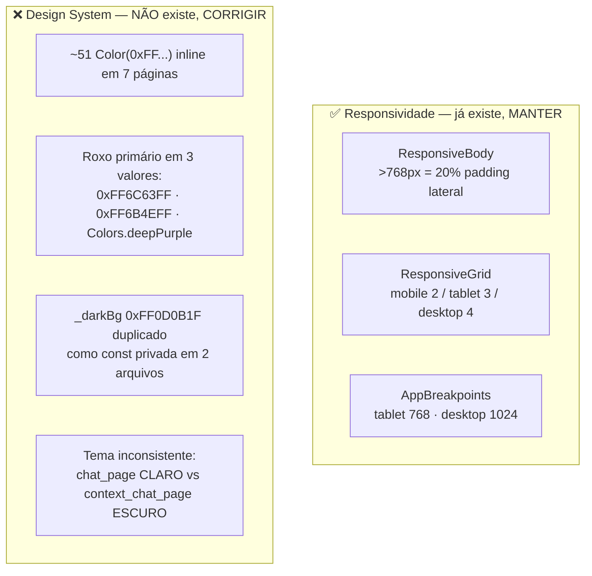
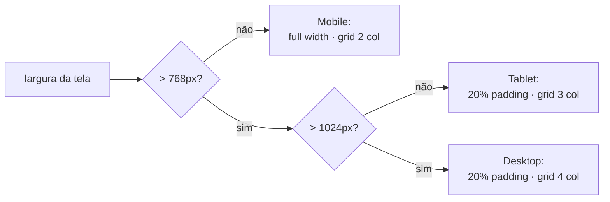

# Design System & Responsividade — English IA

> **Quando ler:** SEMPRE antes de criar ou editar qualquer coisa visual —
> `page`, `widget`, tema, cor, espaçamento, breakpoint. Se você vai escrever
> `Color(...)`, `EdgeInsets`, `MediaQuery` de largura ou um `TextStyle`, este
> documento manda.
>
> **Objetivo:** uma única fonte de verdade visual. Hoje o app tem responsividade
> boa, mas **zero design system** (cores duplicadas inline). Esta skill define o
> alvo e as regras de convergência.

---

## 1. Estado atual (diagnóstico real do código)



- **Responsividade:** `lib/core/widgets/responsive_layout.dart` — bom, reutilizável. **Não recriar.**
- **Design system:** inexistente. Cores nascem inline em cada page. É o débito a pagar.

---

## 2. Regras inquebráveis (o "nunca" da UI)

| ❌ Nunca | ✅ Sempre |
|---|---|
| `Color(0xFF6C63FF)` / `Colors.deepPurple` inline | Token de `AppColors` (ver §3) |
| `const _darkBg = Color(...)` privado numa page | Token compartilhado em `AppColors` |
| `EdgeInsets.all(16)` com número mágico | `AppSpacing.md` (escala de 4) |
| `TextStyle(fontSize: 18, ...)` solto | `AppTextStyles.*` ou `Theme.of(context).textTheme` |
| `if (MediaQuery.of(context).size.width > 768)` | `ResponsiveBody` / `ResponsiveGrid` / `AppBreakpoints` |
| Criar widget novo sem checar `lib/core/widgets/` | Reusar o existente; se não houver, **perguntar ao Diogo** antes de criar |
| Misturar tema claro e escuro entre páginas | **Tema escuro** é o padrão do app (Material 3, dark) |

> ⚠️ **Regra do Diogo (global):** nunca criar componente/widget sem antes verificar
> se já existe algo similar no projeto. `grep` em `lib/core/widgets/` e nas `pages/` primeiro.

---

## 3. Tokens canônicos (fonte única de verdade)

> Estes valores foram **derivados do código atual**, escolhendo um vencedor onde
> havia conflito. Quando formos implementar, criar em `lib/core/theme/`:
> `app_colors.dart`, `app_spacing.dart`, `app_text_styles.dart`. **Não implementar
> sem alinhar com o Diogo** (regra de não criar objeto sem perguntar).

### 3.1 Cores — `AppColors`
```dart
// lib/core/theme/app_colors.dart  (ALVO — criar quando aprovado)
class AppColors {
  // Primária — VENCEDORA do conflito (era seed do ThemeData).
  // Substitui 0xFF6B4EFF e Colors.deepPurple em TODO o app.
  static const primary       = Color(0xFF6C63FF);
  static const primaryHover  = Color(0xFF9B7FFF); // usado em gradientes

  // Superfícies (tema escuro — padrão do app)
  static const background    = Color(0xFF0D0B1F); // era _darkBg duplicado
  static const surface       = Color(0xFF1A1835); // bolha IA / cards
  static const surfaceAlt    = Color(0xFF12102A); // barra de input
  static const surfaceInput  = Color(0xFF1E1C38);

  // Texto
  static const onPrimary     = Color(0xFFFFFFFF);
  static const textPrimary   = Color(0xFFFFFFFF);
  static const textSecondary = Color(0xB3FFFFFF); // white @ 70%

  // Feedback
  static const danger        = Color(0xFFE74C3C); // == Colors.redAccent do mic
  static const success       = Color(0xFF27AE60);
}
```

**Paleta de gradientes de tópico** (hoje inline em `topic_selection_page.dart`, linhas 46–52):
mover para `AppColors.topicGradients` (lista de pares). Não duplicar em outra page.

### 3.2 Espaçamento — `AppSpacing` (escala base 4)
```dart
class AppSpacing {
  static const xs = 4.0;
  static const sm = 8.0;
  static const md = 16.0;  // padrão de padding/gap
  static const lg = 24.0;
  static const xl = 32.0;
}
```
> O `ResponsiveGrid` já usa `16` de spacing → passa a referenciar `AppSpacing.md`.

### 3.3 Tipografia — `AppTextStyles`
Preferir `Theme.of(context).textTheme` (Material 3). Só criar tokens próprios para
estilos recorrentes que fogem do textTheme (ex.: título de bolha de chat).

### 3.4 Tema central — `ThemeData`
`main.dart` deve derivar do token: `ColorScheme.fromSeed(seedColor: AppColors.primary)`
com `brightness: Brightness.dark`. Nenhuma page deve pintar fundo com `Color(...)` cru —
usa `Theme.of(context).colorScheme.surface/background`.

---

## 4. Responsividade — codificando o que já existe



**Regras:**
1. Todo conteúdo de página passa por `ResponsiveBody` (centra e limita em telas largas).
2. Toda grade usa `ResponsiveGrid` (colunas por breakpoint) — nunca `GridView` cru com `crossAxisCount` fixo.
3. Breakpoint só via `AppBreakpoints.tablet` / `.desktop`. Proibido número mágico (`768`/`1024`) espalhado.
4. Precisa de um novo comportamento responsivo? **Estender** `responsive_layout.dart`, não criar helper paralelo.

---

## 5. Checklist antes de commitar UI

- [ ] Nenhum `Color(0xFF...)` / `Colors.xxx` inline novo — tudo via `AppColors`.
- [ ] Nenhum breakpoint numérico solto — via `AppBreakpoints`.
- [ ] Página envolvida por `ResponsiveBody`; grades via `ResponsiveGrid`.
- [ ] Espaçamentos via `AppSpacing`; textos via `textTheme`/`AppTextStyles`.
- [ ] Tema **escuro** e consistente com as demais páginas.
- [ ] Widget reaproveitado (checou `lib/core/widgets/` antes de criar).
- [ ] Nada de tema claro (`Colors.white`/`grey[200]`) numa tela nova.

---

## 6. Débito técnico mapeado (para refatoração futura)

> Ordem sugerida quando o Diogo autorizar refatorar (nenhum passo é "criar sem perguntar" —
> é a lista do que existe pra pagar):

1. Criar `lib/core/theme/` com `AppColors` + `AppSpacing` (tokens do §3).
2. Unificar o roxo: trocar `0xFF6B4EFF` e `Colors.deepPurple` → `AppColors.primary`.
3. Remover `_darkBg` duplicado (`topic_selection_page.dart`, `context_chat_page.dart`).
4. Padronizar `chat_page.dart` para tema escuro (hoje é o ponto fora da curva).
5. Migrar as ~51 cores inline página a página para tokens.
6. Ligar `ThemeData` aos tokens em `main.dart`.

---

## Referências
- `lib/core/widgets/responsive_layout.dart` — helpers de responsividade (fonte da verdade).
- `lib/main.dart` — `ThemeData` / seed color.
- `.agents/skills/sdd_voice_chat/SKILL.md` — skill irmã (voz/SRS).
- CLAUDE.md do projeto — arquitetura (Clean Arch + GetX) e pontos-chave.
