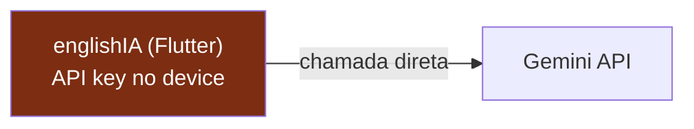
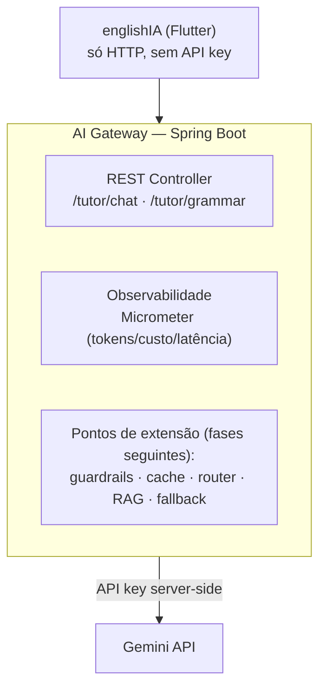

# ADR-001 — Introduzir um AI Gateway (tirar a IA do cliente)

> **Status:** proposto · **Data:** 2026-07-19 · **Decisor:** Diogo
> **Substitui:** — · **Relaciona:** ADR-002 (fallback), ADR-003 (vector DB), ADR-004 (model router)

## Contexto

Hoje o `english_ia` (Flutter) fala **direto** com a API do Gemini a partir do cliente.
Verificado no código:

- `lib/data/datasources/gemini_datasource.dart` usa `google_generative_ai` no device.
- A `GEMINI_API_KEY` é carregada no cliente (`Constants.geminiApiKey`, `ConfigService`, `settings_page.dart`).
- Modelo fixo `gemini-2.5-flash`, sem cache, sem roteamento, sem fallback, sem telemetria de custo.

### Problema
1. **Segurança:** a chave vive no dispositivo — extraível de um binário/tráfego. Qualquer um com o app pode usar a cota.
2. **Sem controle de custo/observabilidade:** impossível medir tokens/custo/latência ou impor budget por usuário.
3. **Teto arquitetural:** guardrails, RAG, cache semântico, roteamento de modelo e fallback **não podem** morar no cliente (segredos de outros provedores, base vetorial, lógica de custo). Sem um ponto no servidor, nenhuma dessas evoluções é possível.

## Decisão

Introduzir um **AI Gateway** em **Java / Spring Boot** entre o Flutter e os LLMs. O app passa a
falar **só HTTP** com o gateway; nenhuma chave de LLM fica no cliente.

### Por que Java/Spring Boot
- Domínio do Diogo (Java 20 na Blue) → entrega rápida e código de qualidade.
- `Micrometer` (observabilidade) e `resilience4j` (retry/circuit breaker — ADR-002) são nativos do ecossistema Spring: as Fases 1 e 5 saem quase "de graça".
- Diferencial "enterprise" numa vaga de AI (a maioria mostra Python/Node).

## Consequências

**Positivas**
- Chave sai do cliente (correção de segurança real e imediata).
- Passa a existir um lugar para medir custo/token desde o dia 1.
- Destrava TODAS as fases seguintes (guardrails, RAG, router, cache, fallback).

**Negativas / custos**
- Passa a existir infra pra manter (deploy, ambiente). Para "laboratório", roda local/1 container.
- Latência extra de 1 hop. Mitigável com cache (Fase 4) e proximidade de deploy.
- O app precisa de refactor: trocar o datasource Gemini por um `HttpDatasource` que chama o gateway.

## Alternativas consideradas

| Alternativa | Por que não |
|---|---|
| Manter IA no cliente | Bloqueia guardrails/RAG/custo/fallback e mantém a chave exposta. É o problema. |
| BaaS (Firebase Functions / Vertex proxy) | Menos controle da lógica de gateway; menos material de arquitetura pra contar; foge do stack Java. |
| Gateway em Node/Python | Ecossistema de IA mais maduro, mas foge do domínio do Diogo e do diferencial enterprise. Reavaliar só se o RAG (ADR-003) exigir. |

## Escopo desta fase (mínimo demonstrável)
- 1 endpoint `POST /tutor/chat` que repassa ao Gemini server-side.
- Logging estruturado de `tokens_in`, `tokens_out`, `custo_estimado`, `latencia_ms` por request.
- App Flutter apontando para o gateway via `HttpDatasource` (a chave sai do device).

> Fora de escopo agora: guardrails, RAG, router, cache, fallback — cada um é um ADR/fase própria.

## Narrativa de entrevista
"A primeira decisão foi tirar a IA do cliente. Enquanto a chave e a chamada viviam no app, eu
não tinha como medir custo nem colocar guardrails — então introduzi um gateway em Spring Boot.
A partir daí passei a medir tokens e custo por request, e destravei guardrails e RAG."
