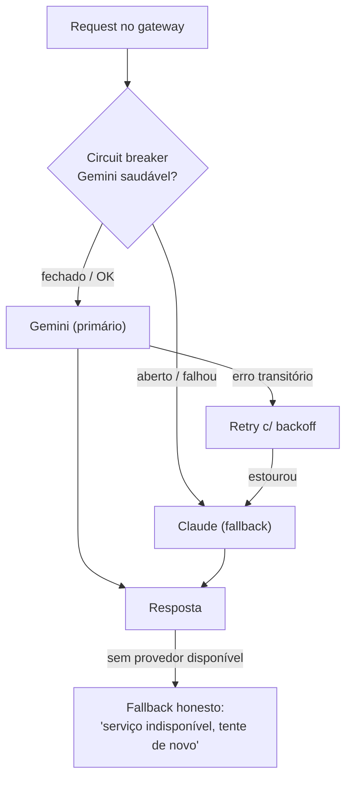

# ADR-002 — Fallback multi-provedor com circuit breaker

> **Status:** proposto · **Data:** 2026-07-19 · **Decisor:** Diogo
> **Depende de:** [[ADR-001-ai-gateway]] (fallback só existe porque há gateway server-side)

## Contexto

Hoje há **um único** provedor (Gemini), sem retry, sem circuit breaker. Se o Gemini cair,
ficar lento ou estourar cota, o tutor simplesmente falha para o usuário. Num serviço com SLO de
disponibilidade (ver [[PRD-ai-tutor]]), isso é inaceitável.

O gateway (ADR-001) agora é o lugar natural para orquestrar mais de um provedor sem expor
segredos no cliente.

## Decisão

**Gemini** como provedor **primário**; **Claude** como **fallback**, orquestrados por
**circuit breaker + retry com backoff** usando **`resilience4j`** (nativo do ecossistema Spring).

### Camadas de fallback (do PRD, RF-08)
1. **Provedor:** Gemini → Claude (circuit breaker).
2. **Retrieval (quando houver RAG, ADR-003):** vector DB cai → busca por keyword (BM25).
3. **Resposta honesta:** sem base/sem provedor → mensagem clara, nunca alucinar.

## Consequências

**Positivas**
- Tutor sobrevive a queda/lentidão do provedor primário → cumpre SLO de disponibilidade.
- `resilience4j` dá circuit breaker, retry e rate limiter com anotações — pouco código.
- Base para comparar custo/qualidade entre provedores (alimenta ADR-004).

**Negativas / custos**
- Segunda chave de API (Claude) para gerenciar server-side.
- Respostas de provedores diferentes têm "voz" diferente → padronizar via system prompt e output guardrail.
- Precisa normalizar contratos (tokens/parsing) entre SDKs distintos.

## Alternativas consideradas

| Alternativa | Por que não |
|---|---|
| Só Gemini + retry | Não cobre queda total do provedor; sem plano B real. |
| Fallback OpenAI em vez de Claude | Válido; escolhi Claude por qualidade em correção/explicação e por já estar familiarizado. OpenAI fica como 2º fallback opcional. |
| Retry manual sem lib | Reinventa circuit breaker; `resilience4j` é padrão testado no Spring. |

## Escopo desta fase (Fase 5, mínimo demonstrável)
- Circuit breaker Gemini→Claude com `resilience4j`.
- Teste que **derruba o Gemini** e prova que o tutor continua respondendo (métrica do PRD).
- Log de qual provedor atendeu cada request.

## Narrativa de entrevista
"Coloquei um circuit breaker com resilience4j: quando o provedor primário falha, o tutor cai
para o Claude sem o usuário perceber. No teste eu derrubo o Gemini de propósito e mostro a taxa
de sucesso mantida — resiliência que dá pra medir, não só afirmar."
