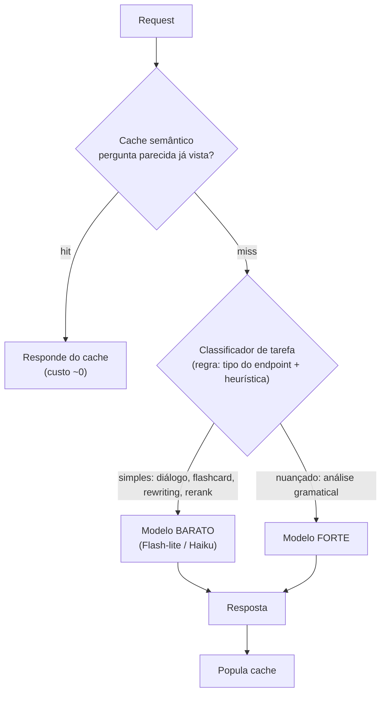

# ADR-004 — Política de roteamento de modelo (model router)

> **Status:** proposto · **Data:** 2026-07-19 · **Decisor:** Diogo
> **Depende de:** [[ADR-001-ai-gateway]] · **Serve ao SLO de custo do** [[PRD-ai-tutor]]

## Contexto

Hoje **todas** as tarefas usam o mesmo modelo fixo (`gemini-2.5-flash`) — do "oi, tudo bem?"
até uma análise gramatical nuançada. Isso é caro no lugar errado (paga modelo à toa em tarefa
trivial) e potencialmente fraco no lugar certo (tarefa difícil no modelo leve).

O gateway (ADR-001) permite decidir **qual modelo** por request, algo impossível no cliente.

## Decisão

Rotear por **complexidade da tarefa**, com **classificação baseada em regra** (rule-based) —
não um LLM roteando (que adicionaria custo/latência). Complementar com **cache semântico**.

### Política de roteamento
| Tarefa | Modelo | Racional |
|---|---|---|
| Diálogo/chat livre simples | barato (Flash-lite/Haiku) | Volume alto, baixa exigência |
| Flashcards / geração de exemplos | barato | Auxiliar |
| Rewriting, rerank, tarefas auxiliares | **sempre** barato | Nunca gastar modelo forte em suporte |
| Análise gramatical nuançada / correção com explicação | **forte** | É o núcleo de qualidade (SLO precisão ≥90%) |

### Cache semântico
"how do I use *make* vs *do*?" é perguntado mil vezes → responde do cache. Meta: cortar **20–40%**
do custo (do `metrica.md`).

## Consequências

**Positivas**
- Corta custo onde não importa; concentra qualidade onde importa.
- Cache semântico derruba latência (SLO p95 ≤ 2s no hit) e custo.
- Classificação por regra = barata, previsível, sem hop extra a LLM.

**Negativas / custos**
- Classificador rule-based erra em casos-limite → prever override "sempre forte" para correção.
- Cache semântico exige embeddings + threshold de similaridade bem calibrado (falso-hit devolve resposta errada). Começar conservador.
- Mais um ponto para observar (taxa de hit, distribuição de rota) — instrumentar via Micrometer.

## Alternativas consideradas

| Alternativa | Por que não |
|---|---|
| Modelo único fixo (hoje) | Caro no trivial, arriscado no difícil. É o problema. |
| Roteador via LLM classificador | Adiciona custo/latência de um LLM só pra decidir; overkill no lab. |
| Só cache, sem router | Deixa dinheiro na mesa nas tarefas auxiliares. |

## Escopo desta fase (Fase 4)
- Classificador rule-based por tipo de endpoint (chat vs grammar) + heurística simples.
- Cache semântico com threshold conservador; medir **% de economia** (métrica do PRD).
- Dashboard mínimo: custo por rota, taxa de cache hit.

## Narrativa de entrevista
"Parei de usar um modelo único pra tudo. Roteei por complexidade — tarefa auxiliar sempre no
barato, análise gramatical no forte — e coloquei cache semântico nas perguntas repetidas.
Medi a economia: X% de corte de custo mantendo a precisão gramatical no SLO."
