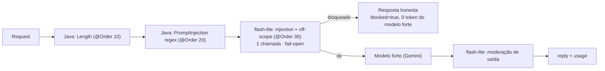

# ADR-005 — Guardrails (governança de entrada e saída)

> **Status:** aceito · **Data:** 2026-07-19 · **Decisor:** Diogo
> **Depende de:** [[ADR-001-ai-gateway]] · **Serve à matriz de risco do** [[PRD-ai-tutor]]
>
> **Revisão (2026-07-19):** a camada ML era o **Lakera Guard** (SaaS). Sem acesso a conta
> Lakera, trocamos por **classificador LLM barato (Gemini flash-lite)** — sem SaaS, sem conta
> nova, reusa o Gemini que o app já usa.

## Contexto

Hoje o tutor aceita qualquer entrada e devolve qualquer saída (sem governança). Riscos:
prompt injection / jailbreak, perguntas fora de escopo (gasta o modelo forte à toa) e conteúdo
impróprio para um público que pode incluir menores (matriz de risco do PRD). Não há lib de
guardrail madura em Java (NeMo, Guardrails AI, LLM Guard, Rebuff são Python/JS), então a decisão
é sobre **como** montar isso no nosso stack.

## Decisão

Um **pipeline de guardrails no gateway** (nunca no cliente), em duas naturezas:

- **Camada determinística (Java):** `LengthInputGuardrail`, `PromptInjectionInputGuardrail` (regex EN/PT) — barato, zero token, primeira linha.
- **Camada ML barata (Gemini flash-lite, ADR-004):**
  - `LlmInputGuardrail` — **uma** chamada ao flash-lite classifica **injection/jailbreak E off-scope** juntos (`{attack, onScope}`). Off-scope barrado **sem gastar o modelo forte**.
  - `LlmModerationOutputGuardrail` — modera a resposta antes de devolver (`{unsafe}`).
  - Ambos **fail-open** (erro do classificador não pune o aluno) e desligáveis via `guardrail.llm-checks-enabled`.
- **Estrutura:** interfaces `InputGuardrail`/`OutputGuardrail` (cada regra = `@Component` ordenado por `@Order`), orquestradas por `GuardrailChain` (fail-fast) a partir do `TutorService`. Helper `GuardrailClassifier` compartilha a chamada ao flash-lite.

## Consequências

**Positivas**
- Injection/entrada inválida barrada **antes** do modelo forte → **0 token** gasto (validado no smoke test).
- **Sem SaaS externo, sem conta nova** — reusa a chave Gemini que o app já usa.
- Input inteiro resolvido em **1 chamada barata** (injection + off-scope juntos) → menos latência.
- Cada guardrail é plugável/testável; observabilidade via `llm.guardrail.blocked{stage,code}` + `blocked`/`reason` na resposta.

**Negativas / custos**
- Classificador de propósito geral (LLM) é um pouco menos preciso que um modelo dedicado a injection.
- Adiciona 1 chamada barata na entrada e 1 na saída (latência/custo pequenos; desligável).

## Alternativas consideradas

| Alternativa | Por que não |
|---|---|
| **Lakera Guard** (SaaS) | Era a escolha inicial (free 10k/mês), mas **sem acesso a conta** → inviável agora. |
| Framework Python (NeMo/Guardrails AI/LLM Guard) | Fora do stack Java; não roda in-process; pesado. |
| Self-hosted ONNX (Prompt Guard/deberta) | Mais preciso, mas exige baixar modelo + ONNX Runtime; alguns modelos são gated no HF. |
| Google Perspective API | Só moderação de toxicidade (saída); não pega injection; exige ativar no GCP. |
| Só determinístico (regex) | Não pega jailbreak/off-scope nuançado. |
| Guardrail no cliente Flutter | Cliente não é confiável — trivial de burlar. |

## Escopo entregue (Fase 2)
- Input: Length, PromptInjection (Java) + injection/off-scope (flash-lite).
- Output: Moderação (flash-lite).
- **Grounding / anti-alucinação:** fica para a **Fase 3** (precisa do RAG para comparar com a base).

## Narrativa de entrevista
"Montei um pipeline de guardrails no gateway: barato e determinístico primeiro, ML depois.
A camada ML era pra ser o Lakera, mas sem acesso a conta eu troquei por um classificador
flash-lite — sem SaaS, reusando o próprio Gemini. Um prompt injection é barrado antes de tocar o
modelo forte (0 token, e eu mostro na métrica), e resolvo injection + off-scope numa única
chamada barata."
