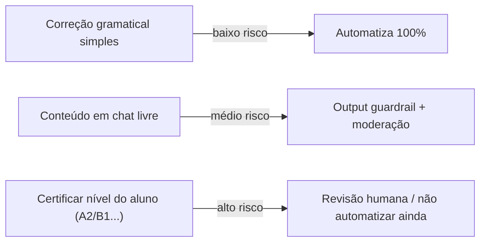
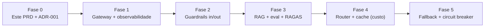

# PRD — AI Tutor (English IA)

> **Status:** rascunho · **Data:** 2026-07-19 · **Autor:** Diogo
> **Depende de:** [[ADR-001-ai-gateway]] (o gateway é pré-requisito físico deste PRD)

## 1. Problema & objetivo

O English IA é um tutor de inglês por IA (conversação, correção gramatical, flashcards SRS,
phrasal verbs, chat livre). Hoje é um cliente que chama o Gemini direto, **sem garantias de
qualidade, custo ou segurança**. Este PRD define o "AI Tutor" como um serviço com **limites de
tolerância mensuráveis** — para que a correção gramatical seja confiável, barata e resiliente.

**Objetivo:** transformar o tutor de "chama o LLM e torce" em "serviço com SLOs, guardrails e
grounding", entregável em fatias demonstráveis.

## 2. Usuários & casos de uso

| Persona | Necessidade | Risco associado |
|---|---|---|
| Estudante de inglês (pode ser menor) | Correção confiável, conversa natural | Alucinação de regra gramatical; conteúdo impróprio |
| Diogo (dono/estudo) | Medir custo e qualidade; contar a história | Custo descontrolado; sem métrica |

**Casos de uso principais**
1. **Chat livre** — conversa aberta em inglês (tutor).
2. **Correção gramatical** — usuário manda frase, recebe correção fundamentada.
3. **Diálogo por cenário** — roleplay (viagem, reunião tech) com feedback JSON estruturado.
4. **Flashcards SRS** — vocabulário com repetição espaçada (SM-2, já existe).

## 3. Requisitos funcionais

- **RF-01** Toda chamada de IA passa pelo gateway (ADR-001) — nada de LLM no cliente.
- **RF-02** Correção gramatical retorna: frase corrigida + explicação + regra citada (grounded).
- **RF-03** Input guardrail barra pergunta fora de escopo (ex.: "como fazer um bolo") e prompt injection **antes** do modelo forte.
- **RF-04** Output guardrail: moderação de conteúdo (público pode ser menor) + checagem anti-alucinação.
- **RF-05** RAG: correção e explicações ancoradas numa base (regras gramaticais, phrasal verbs, histórico/erros do aluno).
- **RF-06** Personalização do histórico do aluno via **MCP server** (`get_student_vocabulary(user_id)`), não acesso livre ao banco.
- **RF-07** Roteamento de modelo por complexidade; cache semântico para perguntas repetidas.
- **RF-08** Fallback multi-provedor com circuit breaker.

## 4. SLOs — limites de tolerância (o coração do PRD)

> São os números que a entrevista quer ouvir ("defini X, medi Y"). Valores iniciais — calibrar com o eval dataset.

| Dimensão | SLO alvo | Como medir |
|---|---|---|
| **Precisão gramatical** | ≥ 90% de acerto no eval dataset | Dataset de frases-teste com gabarito |
| **Grounding (Faithfulness)** | ≥ 0.90 (RAGAS) — não inventar regra | Métrica RAGAS na resposta vs. contexto recuperado |
| **Context Relevance** | ≥ 0.80 (RAGAS) | RAGAS no top-k recuperado |
| **Answer Relevance** | ≥ 0.85 (RAGAS) | RAGAS resposta vs. pergunta |
| **Latência** | p95 ≤ 4 s (chat), ≤ 2 s (cache hit) | Micrometer no gateway |
| **Custo/sessão** | ≤ orçamento X tokens por sessão | Logging de tokens desde o dia 1 |
| **Guardrail off-scope** | ≥ 95% de perguntas fora de escopo barradas sem gastar modelo forte | Suite de prompts adversariais |
| **Disponibilidade** | tutor responde mesmo com provedor primário caído | Teste derrubando o Gemini → fallback |

## 5. Matriz de risco (human-in-the-loop)

## 6. Eval dataset (critério de aceite)

- Conjunto versionado de frases-teste com gabarito (correção esperada + regra).
- Roda a cada mudança de prompt/modelo → mede precisão e RAGAS.
- Sem o eval, nenhum SLO é verificável. É entregável da Fase 3.

## 7. Estratégia de fallback (resumo — detalhe no ADR-002)

- **Provedor:** Gemini (primário) → Claude/OpenAI (fallback) via circuit breaker.
- **Retrieval:** vector DB cai → busca por keyword (BM25).
- **Resposta honesta:** sem base suficiente → "não encontrei base para afirmar isso" em vez de inventar.

## 8. Fora de escopo (v1 laboratório)

- App multiusuário com auth robusta e billing real.
- RAG de produção com re-indexação contínua.
- Certificação de nível do aluno (alto risco — fica manual).

## 9. Fases de entrega (cada uma = 1 métrica contável)

## Referências
- [[ADR-001-ai-gateway]] — decisão do gateway.
- `metrica.md` — guia de estudo/entrevista que originou este plano.
- CLAUDE.md do projeto — arquitetura atual (Clean Arch + GetX + Gemini + Isar).
